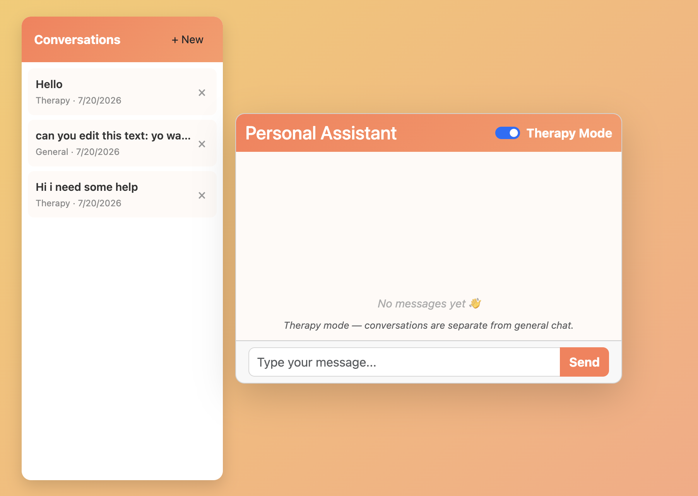

# ConvoAI

ConvoAI is a full-stack conversational assistant with general and therapy-oriented chat modes. It uses React for the interface, Spring Boot for the API, PostgreSQL for persistent conversation history, and the OpenAI API for responses.

> Therapy mode offers supportive conversation but is not a replacement for professional mental-health care.

## Preview



## Features

- General and therapy-oriented conversation modes
- Persistent PostgreSQL conversation history
- Conversation sidebar with generated titles
- Restore, switch, create, and delete conversations
- Browser-scoped anonymous sessions
- Docker Compose support for local development

## Stack

- React 19, Vite, Bootstrap, and Axios
- Java 21, Spring Boot 3.5, Spring Data JPA, and Maven
- PostgreSQL 16
- OpenAI API
- Docker and Docker Compose

## Quick start

Create a root `.env` file containing your OpenAI and PostgreSQL settings, then run:

```bash
source load-env.sh
docker compose up postgres -d
```

Start the backend:

```bash
cd sb-backend/sb-backend
./mvnw spring-boot:run
```

In another terminal, start the frontend:

```bash
cd react-frontend
npm install
npm run dev
```

Open [http://localhost:5173](http://localhost:5173).

## Project structure

```text
ConvoAI/
├── react-frontend/       # React user interface
├── sb-backend/          # Spring Boot API
├── docs/               # Technical documentation
├── docker-compose.yml
├── example.env
└── load-env.sh
```

See [Architecture and API](docs/ARCHITECTURE.md) for session management, database structure, configuration, and endpoint details.
