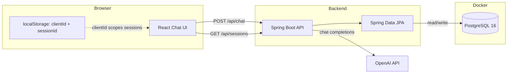

# ConvoAI - Intelligent Chatbot Assistant

## Project Description

ConvoAI is a full-stack web application that provides an intelligent conversational AI assistant with **two distinct modes**:

1. **Default Mode**: A general-purpose helpful assistant
2. **Therapy Mode**: A supportive, non-judgmental listener designed to provide empathetic support (not a replacement for professional mental health services)

The application maintains conversation history per session in **PostgreSQL**, allowing users to have continuous, contextual conversations that survive backend restarts. Built with a modern React frontend and Spring Boot backend, it integrates with OpenAI's API to deliver intelligent responses.

---

## Quick Start

```bash
cp example.env .env          # add your OPENAI_API_KEY
source load-env.sh           # load env vars (local dev)

docker compose up postgres -d   # start PostgreSQL

cd sb-chatgpt/sb-chatgpt && ./mvnw spring-boot:run   # terminal 1
cd chatgpt-react && npm install && npm run dev       # terminal 2
```

Open http://localhost:5173

> **Set `OPENAI_API_KEY` and Postgres credentials in `.env`.** See [PostgreSQL in ConvoAI](#postgresql-in-convoai) for how the database fits in.

---

## Features

### Core Features

✅ **Dual Conversation Modes**

- Toggle between General Assistant and Therapy Mode
- Each mode has distinct system prompts and behavioral guidelines
- Sessions are **mode-locked** — switching modes starts a new conversation

✅ **Session Management**

- **PostgreSQL-backed** conversation history (survives backend restarts)
- Sidebar listing past conversations with auto-generated titles
- Anonymous `clientId` scopes sessions to your browser
- Automatic session ID generation and management
- Session ID and mode stored in browser `localStorage`
- **Conversation restore on page reload** via `GET /api/chat/{sessionId}`
- Delete conversations from the sidebar
- "New" button to start fresh conversations

✅ **Real-time Chat Interface**

- Modern, responsive chat UI built with React & Bootstrap
- Auto-scrolling chat messages
- Type-to-send with Enter key support
- Visual distinction between user and bot messages

✅ **Context-Aware Responses**

- Maintains full conversation history
- AI responds based on complete conversation context
- Supports multi-turn conversations

✅ **Error Handling**

- Graceful error messages for API failures
- Validation for empty prompts
- Connection error handling
- Stale session handling (404 clears local session if not found)

✅ **Conversation Sidebar**

- Lists all sessions for the current browser
- Auto-titles from the first user message
- Click to switch between conversations
- Shows mode (General / Therapy) and last active time

✅ **CORS Support**

- Cross-origin requests enabled for flexible deployment

✅ **Environment-Based Configuration**

- API keys and model settings loaded from `.env`
- `example.env` template for easy setup
- `load-env.sh` helper for local development

### Therapy Mode Features

- Specialized system prompt for supportive listening
- Brief, reflective responses
- Open-ended questions to deepen understanding
- Crisis detection capability (mentions 988 helpline)
- Professional boundaries (no diagnoses or medical advice)

---

## Technology Stack

### Frontend

- **Framework**: React 19
- **Build Tool**: Vite 7
- **Styling**: Bootstrap 5
- **HTTP Client**: Axios
- **Language**: JavaScript (JSX)

### Backend

- **Framework**: Spring Boot 3.5.4
- **Language**: Java 21
- **Build Tool**: Maven
- **HTTP Client**: Spring RestClient
- **Database**: PostgreSQL 16 + Spring Data JPA

### Deployment

- **Containerization**: Docker & Docker Compose (Postgres + backend + frontend)
- **External API**: OpenAI API (configurable via `OPENAI_API_MODEL`)

---

## Installation & Setup

### Prerequisites

**Option 1: Docker (Recommended)**

- Docker Desktop 4.0+
- Docker Compose 2.0+

**Option 2: Local Development**

- Java 21 or higher
- Maven 3.6+ (or use the included `./mvnw` wrapper)
- Node.js 18+ & npm

**For Both Options**

- OpenAI API Key (get it from: https://platform.openai.com/api-keys)

---

## Environment Variables

Secrets and API settings are **not** stored in `application.properties`. Use a `.env` file at the project root instead.

### Setup

1. **Copy the example file**

   ```bash
   cp example.env .env
   ```

2. **Add your OpenAI API key to `.env`**

   ```bash
   OPENAI_API_KEY=your-openai-api-key
   OPENAI_API_MODEL=gpt-4.1
   OPENAI_API_URL=https://api.openai.com/v1/chat/completions

   POSTGRES_USER=your-postgres-user
   POSTGRES_PASSWORD=your-postgres-credential
   POSTGRES_DB=your-postgres-db
   SPRING_DATASOURCE_URL=jdbc:postgresql://localhost:5432/your-postgres-db
   SPRING_DATASOURCE_USERNAME=your-postgres-user
   SPRING_DATASOURCE_PASSWORD=your-postgres-credential
   ```

   Use **no quotes** and **no spaces** around `=`.

   > For Docker, `SPRING_DATASOURCE_URL` is overridden automatically to point at the `postgres` container. The value above is for local development.

### Variable Reference

| Variable | Required | Default | Description |
|----------|----------|---------|-------------|
| `OPENAI_API_KEY` | Yes | — | Your OpenAI API key |
| `OPENAI_API_MODEL` | No | `gpt-4.1` | Model sent to OpenAI |
| `OPENAI_API_URL` | No | `https://api.openai.com/v1/chat/completions` | Chat completions endpoint |
| `POSTGRES_USER` | Yes | — | PostgreSQL username |
| `POSTGRES_PASSWORD` | Yes | — | PostgreSQL credential |
| `POSTGRES_DB` | Yes | — | PostgreSQL database name |
| `SPRING_DATASOURCE_URL` | Yes | — | JDBC URL (local dev) |

### Load variables into your shell (local dev)

```bash
source load-env.sh
```

This exports all variables from `.env` for the current terminal session.

> **Note:** `.env` is gitignored. Only `example.env` is committed to the repository.

---

## Running the Application

### Option 1: Docker Compose (Easiest)

1. **Clone the repository**

   ```bash
   cd ConvoAI
   ```

2. **Set up environment variables**

   ```bash
   cp example.env .env
   # Edit .env and add your OPENAI_API_KEY
   ```

3. **Build the backend JAR and start containers**

   ```bash
   cd sb-chatgpt/sb-chatgpt && ./mvnw clean package -DskipTests && cd ../..
   docker-compose up --build
   ```

   Docker Compose starts **PostgreSQL**, the backend, and the frontend. It reads `.env` automatically.

4. **Access the application**

   - Frontend: http://localhost:5173
   - Backend API: http://localhost:8080/api/chat
   - PostgreSQL: localhost:5432 (optional external access)

5. **Stop the application**

   ```bash
   docker-compose down
   ```

---

### Option 2: Local Development

#### Backend Setup (Spring Boot)

1. **Start PostgreSQL**

   Either use Docker for Postgres only:

   ```bash
   docker compose up postgres -d
   ```

   Or run your own PostgreSQL instance and match credentials in `.env`.

2. **Set up environment variables**

   ```bash
   cp example.env .env
   # Edit .env and add your OPENAI_API_KEY
   source load-env.sh
   ```

3. **Navigate to backend directory**

   ```bash
   cd sb-chatgpt/sb-chatgpt
   ```

4. **Build and run the backend**

   ```bash
   ./mvnw clean package -DskipTests
   ./mvnw spring-boot:run
   ```

   - Backend will start on: http://localhost:8080

   > **Important:** After changing `.env`, you must **restart the backend** for new values (especially `OPENAI_API_KEY`) to take effect. Spring reads environment variables at startup only.

   > **Hybrid setup (recommended if Docker image pulls fail):** Run only Postgres in Docker and the app locally — see [Quick Start](#quick-start).

#### Frontend Setup (React)

1. **In a new terminal, navigate to frontend directory**

   ```bash
   cd chatgpt-react
   ```

2. **Install dependencies**

   ```bash
   npm install
   ```

3. **Start development server**

   ```bash
   npm run dev
   ```

   - Frontend will start on: http://localhost:5173

4. **Build for production (optional)**

   ```bash
   npm run build
   ```

#### Lint the frontend (optional)

```bash
npm run lint
```

---

## PostgreSQL in ConvoAI

PostgreSQL is the **persistent store** for all conversations. Before this, sessions lived in an in-memory map and were lost every time the backend restarted. Now every message is saved to the database and can be loaded again from the sidebar or on page reload.

### Do you need to install or configure Postgres?

| Scenario | What you do |
|----------|-------------|
| **Docker Compose (full stack)** | Nothing — Postgres starts automatically with defaults from `.env` |
| **Local dev (hybrid)** | Run `docker compose up postgres -d` — no separate Postgres install |
| **Custom credentials** | Optional — change `POSTGRES_USER`, `POSTGRES_PASSWORD`, `POSTGRES_DB` in `.env` before first run |

You do **not** need to create tables, run SQL migrations manually, or install pgAdmin. Spring Boot + JPA handle schema creation on startup.

### Architecture



### How Docker sets up PostgreSQL

When you run `docker compose up`, the `postgres` service in `docker-compose.yml`:

1. Pulls the `postgres:16-alpine` image
2. Creates a database using values from `.env` (user, credential, and database name you provide)
3. Stores data in a named volume `postgres_data` so conversations **survive container restarts**
4. Exposes port `5432` to your machine (for local backend access)
5. Runs a healthcheck — the backend waits until Postgres is ready before starting

The backend container connects using an internal Docker hostname:

```
jdbc:postgresql://postgres:5432/your-postgres-db
```

When you run the backend **locally** (not in Docker), it uses:

```
jdbc:postgresql://localhost:5432/your-postgres-db
```

Both point at the same Postgres container — only the hostname differs.

### Database schema

Spring JPA creates and updates these tables automatically (`spring.jpa.hibernate.ddl-auto=update`):

**`chat_sessions`** — one row per conversation

| Column | Type | Purpose |
|--------|------|---------|
| `id` | VARCHAR (UUID) | Primary key — session ID sent to the frontend |
| `client_id` | VARCHAR | Anonymous browser ID — scopes sessions per user |
| `mode` | VARCHAR | `default` or `therapy` — locked at creation |
| `title` | VARCHAR | Auto-generated from first user message |
| `created_at` | TIMESTAMP | When the session was created |
| `last_active_at` | TIMESTAMP | Updated on every message — used to sort sidebar |

**`chat_messages`** — one row per message in a conversation

| Column | Type | Purpose |
|--------|------|---------|
| `id` | BIGINT | Auto-generated primary key |
| `session_id` | VARCHAR | Foreign key → `chat_sessions.id` |
| `role` | VARCHAR | `system`, `user`, or `assistant` |
| `content` | TEXT | Message text |
| `created_at` | TIMESTAMP | When the message was saved |

Deleting a session cascades — all its messages are removed from the database.

### What gets saved, and when

| Event | Database action |
|-------|-----------------|
| First message in a new chat | New `chat_sessions` row + system prompt message + user message |
| AI responds | Assistant message appended to `chat_messages` |
| First user message | Session `title` updated (truncated to 50 chars) |
| Every message | `last_active_at` updated on the session |
| Page reload | Frontend reads from DB via `GET /api/chat/{sessionId}` |
| Sidebar load | Frontend reads session list via `GET /api/sessions?clientId=...` |
| Delete conversation | Session + all messages removed |
| Backend restart | **Data preserved** — Postgres volume keeps everything |

### How `clientId` works with PostgreSQL

There is no user login yet. Instead, the frontend generates a UUID on first visit and stores it in `localStorage` as `chat.clientId`. Every session row in Postgres is tagged with this `client_id`.

- `GET /api/sessions?clientId=...` — returns only **your** conversations
- `GET /api/chat/{id}?clientId=...` — returns history only if the session belongs to you
- `DELETE /api/sessions/{id}?clientId=...` — can only delete your own sessions

If you clear browser storage, you get a new `clientId` and lose access to the old session list (the data still exists in Postgres, but the app no longer knows which rows are yours).

### Default credentials (local dev)

These must be set in `.env` (no defaults committed to the repo):

```bash
POSTGRES_USER=your-postgres-user
POSTGRES_PASSWORD=your-postgres-credential
POSTGRES_DB=your-postgres-db
```

Change `POSTGRES_PASSWORD` before first run if you want something stronger. If you change it **after** Postgres has already been initialized, the old volume keeps the original password — reset with:

```bash
docker compose down -v    # WARNING: deletes all conversation data
docker compose up --build
```

### Inspecting the database (optional)

Connect with any Postgres client using the defaults above, or from the command line:

```bash
docker compose exec postgres psql -U "$POSTGRES_USER" -d "$POSTGRES_DB" -c "SELECT id, title, mode, last_active_at FROM chat_sessions ORDER BY last_active_at DESC LIMIT 10;"
```

---

## API Endpoints

### Send a Message

**POST** `/api/chat`

**Request Body**

```json
{
  "prompt": "Your message here",
  "mode": "default",
  "sessionId": "existing-session-id-or-null",
  "clientId": "browser-client-uuid"
}
```

- `mode`: `"default"` or `"therapy"`
- `sessionId`: omit or pass `null` to start a new session
- `clientId`: required — anonymous browser identifier (stored in `localStorage`)

**Response**

```json
{
  "sessionId": "unique-session-uuid",
  "reply": "AI assistant response",
  "mode": "default"
}
```

**Mode mismatch error** (when sending a different mode to an existing session)

```json
{
  "sessionId": "existing-session-uuid",
  "reply": "This session is locked to therapy mode. Start a new session to switch modes.",
  "mode": "therapy"
}
```

**Validation error**

```json
{
  "sessionId": null,
  "reply": "Please provide a prompt.",
  "mode": null
}
```

---

### Get Session History

**GET** `/api/chat/{sessionId}?clientId={clientId}`

Returns prior user and assistant messages for a session (system prompt excluded). Requires matching `clientId`.

**Response** `200 OK`

```json
{
  "sessionId": "unique-session-uuid",
  "mode": "therapy",
  "messages": [
    { "role": "user", "content": "Hello" },
    { "role": "assistant", "content": "Hi, how can I help?" }
  ]
}
```

**Response** `404 Not Found` — session does not exist or belongs to another client

---

### List Sessions

**GET** `/api/sessions?clientId={clientId}`

Returns all sessions for a browser, newest first. Used by the sidebar.

**Response** `200 OK`

```json
[
  {
    "sessionId": "unique-session-uuid",
    "title": "Help with job stress",
    "mode": "therapy",
    "createdAt": "2026-07-20T14:00:00Z",
    "lastActiveAt": "2026-07-20T14:05:00Z"
  }
]
```

---

### Delete Session

**DELETE** `/api/sessions/{sessionId}?clientId={clientId}`

Deletes a conversation and all its messages.

**Response** `204 No Content` — deleted successfully

**Response** `404 Not Found` — session not found or belongs to another client

---

## Configuration

### Backend Configuration

`sb-chatgpt/sb-chatgpt/src/main/resources/application.properties` maps environment variables to Spring properties:

```properties
openapi.api.url=${OPENAI_API_URL:https://api.openai.com/v1/chat/completions}
openapi.api.model=${OPENAI_API_MODEL:gpt-4.1}

spring.datasource.url=${SPRING_DATASOURCE_URL:}
spring.jpa.hibernate.ddl-auto=update
spring.application.name=sb-chatgpt
server.port=8080
```

Secrets (`OPENAI_API_KEY`, Postgres credentials) are **not** in this file. Set them in `.env` — Spring reads `OPENAI_API_KEY`, `SPRING_DATASOURCE_USERNAME`, and `SPRING_DATASOURCE_PASSWORD` from the environment.

### Frontend Configuration

The frontend connects to the backend at `http://localhost:8080` by default. To change this, edit `chatgpt-react/src/components/Chatbot.jsx`:

```javascript
const API_BASE = "http://localhost:8080/api";  // ← Change this
```

---

## Project Structure

```
ConvoAI/
├── .env                            # Local secrets (gitignored — create from example.env)
├── example.env                     # Environment variable template
├── load-env.sh                     # Shell helper to export .env variables
├── docker-compose.yml              # Postgres + backend + frontend
├── .gitignore
├── chatgpt-react/                  # React Frontend
│   ├── src/
│   │   ├── App.jsx
│   │   ├── components/
│   │   │   └── Chatbot.jsx         # Chat UI, sidebar, session restore
│   │   ├── index.css
│   │   └── main.jsx
│   ├── package.json
│   ├── vite.config.js
│   └── Dockerfile
└── sb-chatgpt/                     # Spring Boot Backend
    ├── Dockerfile
    └── sb-chatgpt/
        ├── pom.xml
        └── src/
            ├── main/
            │   ├── java/com/springboot/sb_chatgpt/
            │   │   ├── SbChatgptApplication.java
            │   │   ├── controller/
            │   │   │   └── ChatGPTController.java
            │   │   ├── service/
            │   │   │   └── ChatGPTService.java
            │   │   ├── entity/
            │   │   │   ├── ChatSessionEntity.java
            │   │   │   ├── ChatMessageEntity.java
            │   │   │   └── SessionMode.java
            │   │   ├── repository/
            │   │   │   └── ChatSessionRepository.java
            │   │   ├── dto/
            │   │   │   ├── ChatResponse.java
            │   │   │   ├── PromptRequest.java
            │   │   │   ├── ChatGPTRequest.java
            │   │   │   ├── ChatGPTResponse.java
            │   │   │   ├── SessionHistoryResponse.java
            │   │   │   ├── SessionSummaryResponse.java
            │   │   │   └── HistoryMessage.java
            │   │   └── config/
            │   │       └── OpenAPIConfiguration.java
            │   └── resources/
            │       └── application.properties
            └── test/
```

---

## How It Works

### Session Flow

1. **User Interaction**

   - User types a message in the React chatbot interface

2. **Frontend Processing**

   - Message is sent to backend via `POST /api/chat`
   - Current session ID, mode, and `clientId` are included

3. **Backend Processing**

   - Backend receives the message
   - If new session: generates UUID, locks mode, saves to PostgreSQL
   - If existing session: validates mode and `clientId` match
   - Adds user message to database; auto-titles from first message
   - Sends complete message history to OpenAI API

4. **AI Response**

   - OpenAI processes the message sequence
   - Returns contextual response based on full conversation
   - Response is added to session history

5. **Response to Frontend**

   - Session ID, mode, and AI reply sent back to React app
   - Frontend displays reply and persists session ID + mode to `localStorage`

6. **Page Reload**

   - Frontend reads saved session ID from `localStorage`
   - Loads session list via `GET /api/sessions?clientId=...`
   - Calls `GET /api/chat/{sessionId}?clientId=...` to restore messages and mode

7. **Mode Switch**

   - Toggling Therapy Mode clears the current session and messages
   - Next message creates a new mode-locked session

8. **Sidebar**

   - Shows all sessions for this browser's `clientId`
   - Click a session to load it; click × to delete

---

## System Prompt Behavior

### Default Mode

```
"You are a helpful, concise assistant."
```

### Therapy Mode

```
"You are a supportive, non-judgemental listener. You are NOT a licensed clinician.
Style: brief reflections, open questions, warmth, concise.
Steps:
1) Reflect what you heard in one sentence.
2) Ask one open question to deepen understanding.
3) Offer one short coping idea ONLY if user asks or gives permission.
4) If user shows signs of improvement, you may proceed to conclude the conversation.
Boundaries: no diagnoses, no medical advice.
Crisis: if you detect imminent self-harm or harm to others, stop normal replies and show crisis info (988 in the U.S)."
```

---

## Known Limitations

⚠️ **Anonymous Sessions**: Sessions are scoped by a browser `clientId`, not user accounts. Clearing browser storage loses access to the session list.

⚠️ **Therapy Mode Disclaimer**: This is NOT a substitute for professional mental health services. It's designed as a supportive tool only.

⚠️ **API Rate Limiting**: Subject to OpenAI's rate limits. Monitor your API usage and costs.

⚠️ **Authentication**: Currently no user authentication. Any client can call the API.

---

## Future Enhancements

- User authentication and authorization
- Multi-user support with user profiles
- Conversation history export
- Fine-tuned models for specialized use cases
- Conversation analytics dashboard
- Rate limiting and quota management
- Multiple AI provider support (Claude, Gemini, etc.)

---

## Troubleshooting

### Backend won't start

- Ensure Java 21 is installed: `java -version`
- Check if port 8080 is available
- Verify Maven or `./mvnw` works: `./mvnw -version`
- Ensure PostgreSQL is running and reachable on port 5432
- Check credentials in `.env` match your Postgres instance
- For Docker: `docker compose logs postgres backend`

### Database connection errors

- Start Postgres: `docker compose up postgres -d`
- Confirm `SPRING_DATASOURCE_URL` points to the right host:
  - Local backend + Docker Postgres: `jdbc:postgresql://localhost:5432/your-postgres-db`
  - Full Docker stack: set via `SPRING_DATASOURCE_URL` in `docker-compose.yml` using `${POSTGRES_DB}`
- Wait for Postgres healthcheck before backend starts (handled automatically in Docker Compose)

### Frontend won't start

- Ensure Node.js 18+ is installed: `node --version`
- Clear npm cache: `npm cache clean --force`
- Delete node_modules and reinstall: `rm -rf node_modules && npm install`

### API Key errors ("Invalid API Key" / 401)

The error message shows which key the backend is using (last 4 characters). If that doesn't match your `.env`, the backend wasn't restarted after you changed the key.

- Confirm your key is set in `.env` (never in `application.properties`)
- Use no quotes and no spaces: `OPENAI_API_KEY=your-key`
- **Restart the backend completely** after any `.env` change:
  ```bash
  source load-env.sh
  cd sb-chatgpt/sb-chatgpt && ./mvnw spring-boot:run
  ```
- For Docker: recreate the backend container (changing `.env` does not update a running container):
  ```bash
  docker compose up -d --force-recreate backend
  ```
- If using IntelliJ, add `OPENAI_API_KEY` to Run Configuration → Environment variables
- Verify the key is active at https://platform.openai.com/api-keys

### Conversation not restored after reload

- Check that the backend and PostgreSQL are running
- Check browser dev tools → Network for `GET /api/sessions` and `GET /api/chat/{sessionId}`
- Clearing browser `localStorage` removes your `clientId` — old sessions remain in the DB but won't appear in the sidebar

### CORS errors

- Backend has `@CrossOrigin("*")` enabled
- Ensure frontend is using the correct backend URL in `Chatbot.jsx`

### Docker issues

- Ensure Docker Desktop is running
- Check Docker logs: `docker compose logs postgres backend`
- Rebuild JAR then containers:
  ```bash
  cd sb-chatgpt/sb-chatgpt && ./mvnw clean package -DskipTests && cd ../..
  docker compose up --build
  ```

### Docker image pull timeouts (`TLS handshake timeout`)

If `eclipse-temurin` or `node` images fail to download, use the **hybrid setup** instead:

```bash
docker compose up postgres -d          # Postgres only
source load-env.sh
cd sb-chatgpt/sb-chatgpt && ./mvnw spring-boot:run
cd chatgpt-react && npm run dev
```

Or retry pulling images manually:

```bash
docker pull postgres:16-alpine
docker pull eclipse-temurin:21-jdk-alpine
docker pull node:20-alpine
docker compose up --build
```

---

## License

This project is open source. See LICENSE file for details.

---

## Support

For issues or questions:

1. Check the troubleshooting section
2. Review the code comments in key files
3. Check OpenAI API documentation: https://platform.openai.com/docs

---

## Security Considerations

🔒 **Important**:

- Never commit your OpenAI API key to version control
- Use `.env` for local secrets; commit only `example.env`
- Rotate keys immediately if they are ever exposed
- Change Postgres credentials from any defaults before production deployment
- Implement authentication for production deployments
- Add rate limiting to prevent abuse
- Validate and sanitize all user inputs
- Use HTTPS in production
- Implement proper CORS policies (restrict from `*`)

---

## Contributing

Contributions are welcome! Please:

1. Fork the repository
2. Create a feature branch
3. Make your changes
4. Submit a pull request

---

**Last Updated**: July 2026
