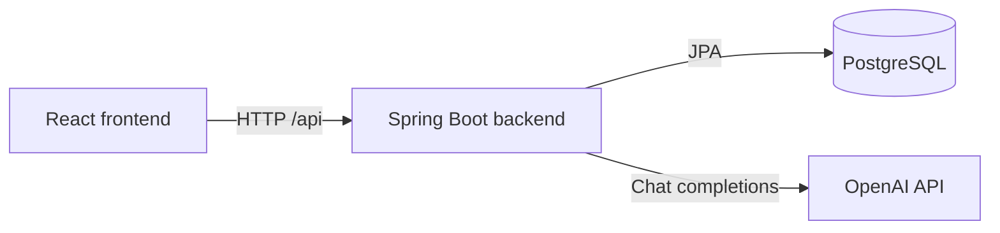

# ConvoAI Architecture and API

## Overview

ConvoAI has three local services:

1. The React frontend renders the chat interface and calls the backend.
2. The Spring Boot backend manages sessions, persists messages, and calls OpenAI.
3. PostgreSQL stores conversations and message history.



## Session management

There is currently no account-based authentication. On first use, the frontend generates a UUID and stores it in browser `localStorage` as `chat.clientId`. It sends this `clientId` with every session request, and the backend uses it to scope database queries.

The backend creates a separate UUID for every conversation. The frontend saves the active value as `chat.sessionId` and sends it with later messages. Selecting **New** clears the active session ID, so the next message creates a new conversation.

Each session is locked to either `default` or `therapy` mode when created. Switching modes begins a new session so the two sets of instructions and conversation histories remain separate.

Because `clientId` is only a browser identifier, clearing browser storage makes the visitor appear new. It is not secure authentication and should be replaced with authenticated user ownership before storing sensitive conversations in a public production application.

## Data model

### `chat_sessions`

| Field | Purpose |
|---|---|
| `id` | Conversation UUID and primary key |
| `client_id` | Anonymous browser identifier |
| `mode` | `default` or `therapy` |
| `title` | Title derived from the first user message |
| `created_at` | Creation timestamp |
| `last_active_at` | Most recent activity timestamp |

### `chat_messages`

| Field | Purpose |
|---|---|
| `id` | Generated message ID |
| `session_id` | Owning conversation |
| `role` | `system`, `user`, or `assistant` |
| `content` | Message text |
| `created_at` | Creation timestamp |

Deleting a session also deletes its messages. Spring Data JPA manages the relationship and Hibernate updates the schema according to the configured `ddl-auto` setting.

## Request flow

1. The frontend sends the prompt, mode, `clientId`, and optional `sessionId` to `POST /api/chat`.
2. The backend verifies that an existing session belongs to that client, or creates a new session.
3. The user message is saved and the session's activity time is updated.
4. The backend sends the session's full message context to OpenAI.
5. The assistant response is saved and returned to the frontend.
6. The frontend refreshes the conversation list and retains the active session in `localStorage`.

## API

| Method | Endpoint | Purpose |
|---|---|---|
| `POST` | `/api/chat` | Send a message or create a conversation |
| `GET` | `/api/sessions?clientId={clientId}` | List a browser's conversations |
| `GET` | `/api/chat/{sessionId}?clientId={clientId}` | Load conversation history |
| `DELETE` | `/api/sessions/{sessionId}?clientId={clientId}` | Delete a conversation |

Example chat request:

```json
{
  "prompt": "Hello",
  "mode": "default",
  "sessionId": null,
  "clientId": "browser-generated-uuid"
}
```

Example response:

```json
{
  "sessionId": "conversation-uuid",
  "reply": "Hello! How can I help?",
  "mode": "default"
}
```

## Configuration

Local secrets belong in the root `.env` file, which is excluded from Git. The backend requires an OpenAI API key and a PostgreSQL connection:

```dotenv
OPENAI_API_KEY=your-key
OPENAI_API_MODEL=gpt-4.1

POSTGRES_USER=your-user
POSTGRES_PASSWORD=your-password
POSTGRES_DB=your-database

SPRING_DATASOURCE_URL=jdbc:postgresql://localhost:5432/your-database
SPRING_DATASOURCE_USERNAME=your-user
SPRING_DATASOURCE_PASSWORD=your-password
```

Run `source load-env.sh` before starting Spring Boot locally. Docker Compose reads `.env` itself and replaces the JDBC hostname with the PostgreSQL service name for the backend container.

The frontend uses `VITE_API_BASE_URL` when configured and otherwise calls `http://localhost:8080/api`.

## Local development

Run PostgreSQL in Docker while running the backend and frontend directly:

```bash
source load-env.sh
docker compose up postgres -d
```

```bash
cd sb-backend/sb-backend
./mvnw spring-boot:run
```

```bash
cd react-frontend
npm install
npm run dev
```

For the full container setup, build the backend JAR before its current image:

```bash
cd sb-backend/sb-backend
./mvnw clean package -DskipTests
cd ../..
docker compose up --build
```

Stop services without deleting database data using `docker compose down`. Avoid `docker compose down -v` unless you intentionally want to delete all saved conversations.

## Production considerations

- Replace anonymous `clientId` ownership with authentication and server-verified authorization.
- Restrict CORS to the deployed frontend origin.
- Store secrets in the hosting provider rather than committing `.env`.
- Use a production frontend build rather than the Vite development server.
- Use managed PostgreSQL with backups and TLS.
- Add database migrations, rate limiting, observability, and content-safety controls.
